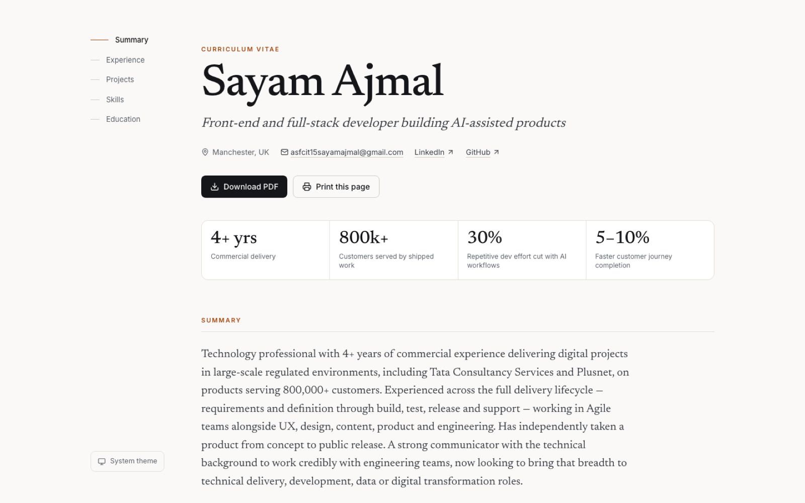

# CV — Sayam Ajmal

My CV as a website: **<https://sayamdev.github.io/cv/>**

Light and dark, readable on a phone, and it prints to a clean one-file PDF
straight from the browser.



---

## Updating it

**Everything lives in one file: [`src/data/cv.ts`](src/data/cv.ts).**

Edit it, commit, push. GitHub Actions rebuilds and republishes the site within
about a minute. There is nowhere else to change anything.

```bash
git clone https://github.com/SayamDev/cv.git
cd cv
npm install
npm run dev        # http://localhost:5173, live reload while you edit
```

The file is typed, so if an entry is missing a field or a date is in the wrong
place, `npm run build` fails before anything is published.

### Common edits

| To change | Edit |
| --- | --- |
| Job title under my name | `headline` |
| The four numbers at the top | `proofPoints` |
| Add a job | A new object at the top of `roles` |
| Add a project | A new object in `projects` |
| Add a skill | The relevant group in `skills` |
| Add my phone number back | Add `phone: '+44 ...'` — see below |

### The downloadable PDF

`public/sayam-ajmal-cv.pdf` is the file behind the **Download PDF** button.
Replace it with a newer one and keep the filename, or change `pdf` in the data
file to match a new name.

You can also regenerate it from the site itself: open the page, click **Print
this page**, and choose "Save as PDF". The print stylesheet strips the
navigation, theme control and links panel, flattens the colours, and keeps
entries from splitting across pages.

---

## A note on the phone number

My phone number is deliberately **not** in the published site. Public pages get
scraped, and a mobile number on one is hard to take back.

It is still on the downloadable PDF, which someone has to deliberately ask for.
To publish it anyway, add one line to `src/data/cv.ts`:

```ts
phone: '+44 7464 606117',
```

It will then appear in the contact row automatically.

---

## Built with

React 19, TypeScript (strict), Vite, Tailwind CSS v4. Inter for the interface,
Newsreader for the display type. No tracking, no analytics, no third-party
requests — the fonts are bundled with the site.

Audited with axe-core against WCAG 2.1 AA: **zero violations** in both themes at
320, 375, 768, 1024 and 1440px, with a skip link, visible focus on every
control and `prefers-reduced-motion` respected.

## Keeping my GitHub profile in step

`public/cv.json` is what makes this repository the single source of truth. My
[profile repository](https://github.com/SayamDev/SayamDev) fetches it and
redraws the skills panel on its README, so I never maintain two copies of the
same list.

It syncs on a daily schedule out of the box. To make it immediate, the deploy
workflow here posts a `repository_dispatch` to the profile repository after a
successful deploy — which needs one secret:

1. Create a **fine-grained** personal access token at
   <https://github.com/settings/personal-access-tokens/new>, with:
   - **Repository access:** only `SayamDev/SayamDev`
   - **Permissions → Repository → Contents:** *Read and write*
   - An expiry you are willing to rotate
2. Store it as a secret on this repository:

   ```bash
   gh secret set PROFILE_SYNC_TOKEN --repo SayamDev/cv
   ```

   The command reads the token from your terminal; it is never written to a
   file or committed.

Without the secret the step prints a note and succeeds — deployment never
depends on it, and the profile still syncs daily.

## Deploying your own

Fork it, replace `src/data/cv.ts` with your own details, set **Settings → Pages
→ Source: GitHub Actions**, and push. If your repository is not called `cv`,
change `REPOSITORY_BASE` in `vite.config.ts`.

## Licence

The code is MIT. The CV content is mine.
